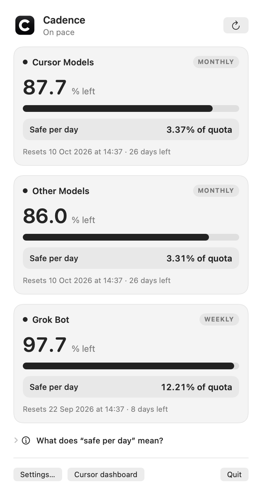

# Cadence

<div align="center">

**A lightweight, zero-config macOS menu bar app that monitors and paces your Cursor AI quotas.**

[](https://github.com/andyfraussen/cadence)
[-brightgreen)](#)
[](https://swift.org)
[](LICENSE)

*Turns your monthly or weekly Cursor quota into a safe daily budget so you can pace yourself through the billing cycle.*

</div>

---

## Overview

If you use **Cursor Pro** or **Pro+**, your fast model requests reset once a month. Coding intensely during the first two weeks can leave you stranded on throttled speeds for the rest of your cycle.

**Cadence** lives quietly in your macOS menu bar. It checks your remaining allowance every minute and computes your **Safe Daily Allowance** (and optional **Weekday-Only Allowance**).



---

## Features

- **Zero Manual Setup (Auto-Sync)**: Reads your active Cursor desktop session directly from local SQLite storage. No copying tokens or pasting API keys required.
- **Independent Quota Pools**: Tracks **Cursor Models** (Agent, auto), **Other Models** (Claude, GPT), and **Grok Bot** (weekly pool) with separate countdowns.
- **Smart Pacing Math**:
  - **Safe Daily Budget**: Divides unused quota across local calendar dates before reset; each partial date counts once, and a reset exactly at midnight excludes that date.
  - **Workday Pacing**: Excludes weekends so you can budget for Monday–Friday workflows.
- **Native Menu Bar Presence**:
  - Monochrome Cadence C icon and/or live remaining percentages directly in your menu bar.
  - Choose between: *Logo only*, *Limits only*, or *Both*.
- **100% Private & Secure**:
  - All communication happens directly between your Mac and Cursor's official API (`https://api2.cursor.sh`).
  - No intermediate servers, no telemetry, no tracking, and no external dependencies.
  - Automatic-only authentication follows Cursor's active desktop session; any legacy manual-mode preferences are removed on launch.
- **Lightweight Native Swift**:
  - Native binary (~600KB per architecture). No Electron, no Chromium, and no background Python/Node server required to run.
  - Runs on Apple Silicon and Intel Macs running macOS 13+.

---

## Installation

### Build from Source (Recommended)

Building directly from source has zero external runtime or package dependencies. Build time depends on your Mac and whether you build both architectures.

The default build uses local ad-hoc signing, not Developer ID signing or notarization. Locally built apps generally avoid download quarantine, but macOS security policy and inherited quarantine attributes can still affect launch.

#### Requirements
- macOS 13.0 or later
- Xcode Command Line Tools (`xcode-select --install`)

#### Quick Start

```bash
# 1. Clone the repository
git clone https://github.com/andyfraussen/cadence.git
cd cadence

# 2. Build the app (Apple Silicon or Intel native)
npm run build:mac
# Or directly without Node/npm:
# bash macos/build.sh

# 3. Move to Applications and open
cp -R dist/Cadence.app /Applications/
open /Applications/Cadence.app
```

> [!TIP]
> To verify everything before running, run the test suite:
> ```bash
> npm run test:mac
> ```

---

### Why We Recommend Building from Source

Building from reviewed source lets you inspect the code accessing your Cursor session, without third-party runtime packages. It is not a guarantee of trust or a bypass of macOS security policy.

Downloaded ad-hoc builds may be blocked by Gatekeeper. Verify the source and release checksum before opening them; a checksum detects corruption but does not establish the publisher's identity. Prefer Developer ID-signed, notarized releases when available. For a build you trust, follow the **Open Anyway** instructions in System Settings → Privacy & Security, if macOS offers them. Do not disable Gatekeeper or clear unrelated extended attributes. See `macos/SHARING.md` for distribution details.

---

## How the Pacing Math Works

The app does not impose arbitrary daily limits; instead, it answers: **"At what average rate can I code today without running dry before the reset?"**

Both modes count local calendar dates overlapping the interval from now up to, but not including, reset. Partial dates count as one; daylight-saving days are still one date. Weekday mode excludes weekends, not holidays. For example, Sunday noon to Monday noon contains two calendar dates but one weekday.

1. **Daily Safe Allowance (All Days)**:
   $$\text{Daily Budget} = \frac{\text{Remaining } \%}{\text{Days Left}}$$

2. **Workday Safe Allowance (Mon–Fri Only)**:
   $$\text{Workday Budget} = \frac{\text{Remaining } \%}{\text{Weekdays Remaining}}$$

3. **Status Warnings**:
   - ⚪ **On pace**: Safe pace with steady reserves.
   - 🔴 **Low (< 10% remaining)**: Critical quota warning.
   - 🟠 **Stale**: Network offline, refresh failed, or server reset passed; pacing paused to prevent misleading metrics.

---

## Security & Privacy

1. **Authentication**: Cursor stores your session token locally in `~/Library/Application Support/Cursor/User/globalStorage/state.vscdb`. The app opens this database with `SQLITE_OPEN_READONLY` and never writes to it.
2. **Network**: Ephemeral `URLSession` requests target `https://api2.cursor.sh/aiserver.v1.DashboardService/GetCurrentPeriodUsage` and `GetSandUsageStatus`. Usage is held in memory only. Hidden Grok does not refresh; visible pools publish independently.
3. **Legacy tokens**: Manual-token authentication is no longer supported. Old Cadence Keychain entries are neither read nor deleted; you may remove the `dev.fraussen.cadence` / `cursor-session` entry yourself in Keychain Access.

---

## License & Disclaimer

This project is open-source under the [MIT License](LICENSE).

*Disclaimer: This is an independent open-source tool and is not officially affiliated with, endorsed by, or sponsored by Anysphere (Cursor) or xAI (Grok).*
